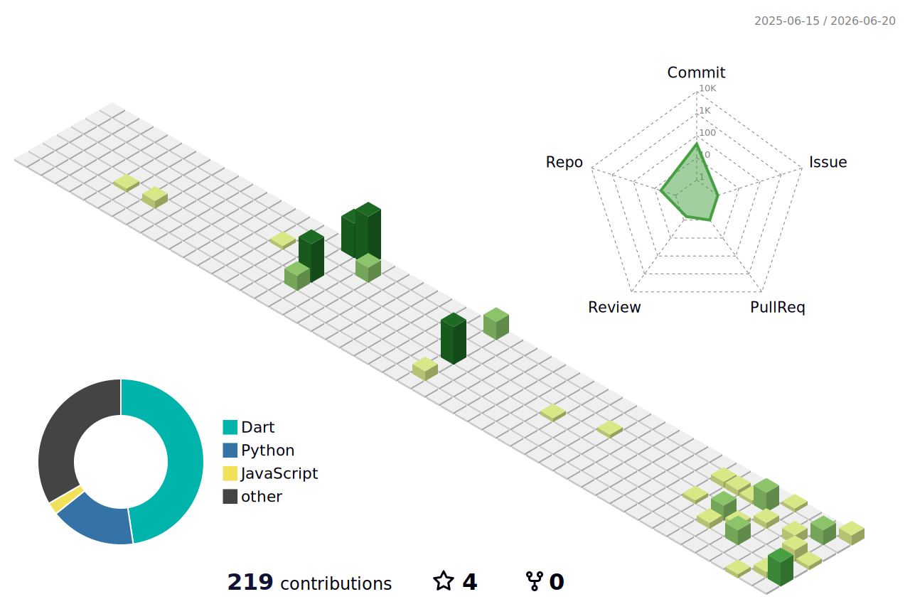

<h1 align="left">Hi there, I'm Yassine Ben Moussa</h1>
<h3 align="left">Computer Science & Multimedia Student | Developer | Tech Enthusiast</h3>

  

### About Me

Hello! I'm **Yassine Ben Moussa**, Computer Science and Multimedia Bachelor’s student with a strong interest in Artificial Intelligence and software development. Certified in AI and Python, with hands-on experience in programming, problem solving, and technical support. Actively seeking an internship or junior role where I can apply AI and programming skills in real-world projects.

---

### Badges

<!-- CREDLY_BADGES_START -->

  
   <b>AI Skills Fest 2026</b> · Jun 2026

<table align="center">
  <tr>
    <td align="center" width="120">
      
       IT Specialist - Artificial Intelligence
    </td>
    <td align="center" width="120">
      
       CCNA: Introduction to Networks
    </td>
    <td align="center" width="120">
      
       C Essentials 1
    </td>
    <td align="center" width="120">
      
       Python Essentials 1
    </td>
  </tr>
</table>
<!-- CREDLY_BADGES_END -->

  

---

### Languages & Tools

  
  
  
  
  
  
  
  
  
  
  
  
  
  
  
  
  

---

### Connect with Me

  
  
  
  <a href="mailto:yassinebenmoussax@gmail.com" target="_blank">
    
      <svg xmlns="http://www.w3.org/2000/svg" viewBox="0 0 16 16" fill="white" width="24" height="24">
        <path d="M0 4a2 2 0 0 1 2-2h12a2 2 0 0 1 2 2v8a2 2 0 0 1-2 2H2a2 2 0 0 1-2-2zm2-1a1 1 0 0 0-1 1v.217l7 4.2 7-4.2V4a1 1 0 0 0-1-1zm13 2.383-4.708 2.825L15 11.105zm-.034 6.876-5.64-3.471L8 9.583l-1.326-.795-5.64 3.47A1 1 0 0 0 2 13h12a1 1 0 0 0 .966-.741M1 11.105l4.708-2.897L1 5.383z"/>
      </svg>
    
  </a>

---

### GitHub Stats

<picture>
  <source media="(prefers-color-scheme: dark)" srcset="./profile-3d-contrib/profile-night-green.svg" />
  <source media="(prefers-color-scheme: light)" srcset="./profile-3d-contrib/profile-green-animate.svg" />
  
</picture>

